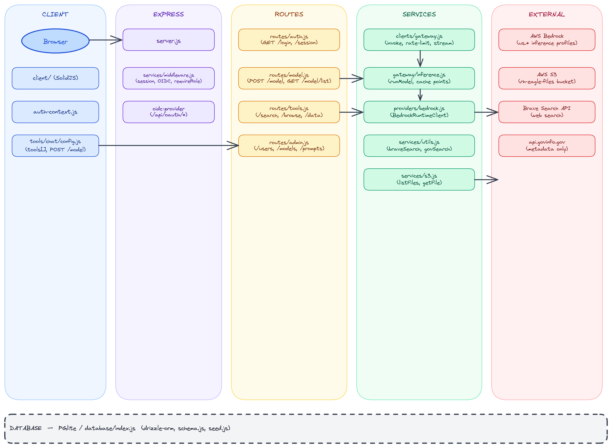
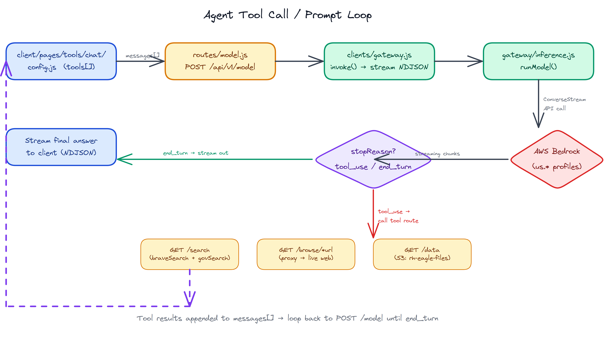

# Research Optimizer

AI research platform for biomedical and regulatory information analysis. Features a streaming chat interface with multi-model AI support, document analysis, web search, and privacy-first local conversation storage.

## Architecture

```
Client (SolidJS) ──► Server (:443) ──┬──► Gateway (:3001) ──► AI Providers
                                     ├──► CMS (:3002)           (Bedrock, Gemini)
                                     └──► PostgreSQL (:5432)
```

### API Architecture



### Agent Tool Call / Prompt Loop



| Package                           | Type           | Port     | Description                                                                    |
| --------------------------------- | -------------- | -------- | ------------------------------------------------------------------------------ |
| [client](client/)                 | Frontend       | —        | Buildless SolidJS chat interface with local IndexedDB storage                  |
| [server](server/)                 | Service        | 443/8080 | Edge server — HTTPS, OAuth, static files, API routing                          |
| [gateway](gateway/)               | Service        | 3001     | AI inference — multi-provider abstraction, usage tracking                      |
| [cms](cms/)                       | Service        | 3002     | Conversation management — agents, conversations, messages, tools, prompts CRUD |
| [agents](agents/)                 | Service (stub) | 3003     | Chat orchestration (planned)                                                   |
| [users](users/)                   | Service (stub) | 3004     | Identity and access management (planned)                                       |
| [database](database/)             | Library        | —        | Drizzle ORM schema, relations, seed data                                       |
| [shared](shared/)                 | Library        | —        | Logger, middleware, utilities                                                  |
| [infrastructure](infrastructure/) | CDK            | —        | AWS deployment (ECR, ECS Fargate, RDS Aurora)                                  |

## Quick Start

```bash
# Start full development environment
docker compose up --build -w

# Access at https://localhost (ignore cert warnings for dev)
```

The client must be served through the server (needs HTTPS, OAuth, API proxy).

## Development Modes

### Docker (recommended)

Runs all services as separate containers with hot reload:

```bash
docker compose up --build -w
```

### Single-Process Monolith

All services run in one process. No `GATEWAY_URL`/`CMS_URL` set — factory clients call service code directly:

```bash
cd server
cp .env.example .env   # Configure with PGlite for easy setup
npm install
npm run start:dev
```

### Multi-Process Microservices

Each service runs separately. Set `GATEWAY_URL` and `CMS_URL` to enable HTTP mode:

```bash
npm start -w gateway   # Port 3001
npm start -w cms       # Port 3002
GATEWAY_URL=http://localhost:3001 CMS_URL=http://localhost:3002 npm start -w server
```

## Environment Variables

Core variables needed across services. See individual service READMEs for complete lists.

| Variable                         | Services        | Description                                       |
| -------------------------------- | --------------- | ------------------------------------------------- |
| `SESSION_SECRET`                 | server          | Cookie signing secret                             |
| `AWS_ACCESS_KEY_ID`              | server, gateway | AWS credentials                                   |
| `AWS_SECRET_ACCESS_KEY`          | server, gateway | AWS credentials                                   |
| `GEMINI_API_KEY`                 | gateway         | Google Gemini API key                             |
| `DB_STORAGE`                     | all             | PGlite data directory (uses embedded PG when set) |
| `DB_SKIP_SYNC`                   | gateway, cms    | Skip schema sync (`true` in microservice mode)    |
| `PGHOST`, `PGUSER`, `PGPASSWORD` | all (postgres)  | PostgreSQL connection                             |
| `GATEWAY_URL`                    | server          | Gateway service URL (enables HTTP mode)           |
| `CMS_URL`                        | server          | CMS service URL (enables HTTP mode)               |
| `OAUTH_CLIENT_ID`                | server          | OIDC client ID                                    |
| `OAUTH_CLIENT_SECRET`            | server          | OIDC client secret                                |
| `BRAVE_SEARCH_API_KEY`           | server          | Brave Search API key                              |

## Testing

```bash
cd server && npm test               # Backend unit tests (Node built-in test runner)
cd server && npm run test:integration  # Full integration tests (Playwright + API)
```

Tests use real services (AWS Bedrock, PostgreSQL/PGlite). No mocking.

## Deployment

Deployed to AWS using CDK. See [infrastructure/](infrastructure/) for details.

```bash
# CI/CD pipeline
./deploy.sh
```

The deploy script builds 3 Docker images (main, gateway, cms), pushes to ECR, and deploys via CDK to ECS Fargate with Aurora Serverless PostgreSQL.

## Project Structure

```
research-optimizer/
├── package.json              # Root workspace config (shared, database, gateway, cms, agents, users, server)
├── docker-compose.yml        # Multi-service development
├── deploy.sh                 # CI/CD deployment script
├── Dockerfile                # Multi-service container image
│
├── client/                   # Frontend (buildless SolidJS, not an npm workspace)
│   ├── components/           # Reusable UI components
│   ├── models/               # IndexedDB, embeddings, data models
│   ├── pages/tools/chat/     # Main chat interface
│   └── utils/                # Client utilities
│
├── server/                   # Edge server (HTTPS, auth, routing)
│   ├── server.js             # Entry point
│   ├── services/
│   │   ├── routes/           # API endpoints (auth, model, tools, admin)
│   │   └── clients/          # Factory clients (gateway.js, cms.js)
│   └── openapi.yaml          # Public API spec
│
├── gateway/                  # AI inference service
│   ├── inference.js          # Provider orchestration
│   ├── providers/            # Bedrock, Gemini, Mock
│   ├── usage.js              # Token tracking
│   └── openapi.yaml          # Service API spec
│
├── cms/                      # Conversation management service
│   ├── conversation.js       # ConversationService class
│   ├── api.js                # REST routes
│   └── openapi.yaml          # Service API spec
│
├── agents/                   # Chat orchestration (stub)
├── users/                    # Identity management (stub)
│
├── database/                 # Shared database package
│   ├── schema.js             # Table definitions, relations, seed data
│   ├── csv-loader.js         # Seed data parser
│   └── data/                 # Seed CSVs
│
├── shared/                   # Shared utilities
│   ├── logger.js             # Winston logging
│   ├── middleware.js          # Request/error logging, nocache
│   └── utils.js              # routeHandler, createHttpError
│
└── infrastructure/        # AWS CDK deployment
    ├── stacks/               # ECR, ECS, RDS stacks
    └── config.py             # Environment configuration
```

## Documentation Index

| Document                                             | Description                              |
| ---------------------------------------------------- | ---------------------------------------- |
| [client/readme.md](client/readme.md)                 | Frontend architecture and components     |
| [server/README.md](server/README.md)                 | Edge server, API reference               |
| [server/openapi.yaml](server/openapi.yaml)           | Public API spec (OpenAPI 3.1)            |
| [gateway/README.md](gateway/README.md)               | Inference service architecture           |
| [gateway/openapi.yaml](gateway/openapi.yaml)         | Gateway API spec (OpenAPI 3.1)           |
| [cms/README.md](cms/README.md)                       | Conversation management service          |
| [cms/openapi.yaml](cms/openapi.yaml)                 | CMS API spec (OpenAPI 3.1)               |
| [database/README.md](database/README.md)             | Data models, ownership matrix, seed data |
| [shared/README.md](shared/README.md)                 | Shared library reference                 |
| [agents/README.md](agents/README.md)                 | Chat orchestration (stub)                |
| [users/README.md](users/README.md)                   | Identity management (stub)               |
| [infrastructure/README.md](infrastructure/README.md) | AWS CDK deployment                       |
| [CLAUDE.md](CLAUDE.md)                               | AI assistant guidance for this codebase  |

## Code Health

This project prioritizes long-term maintainability measured by one thing: **the cost of the next change should stay roughly constant over time.** When that cost grows, the architecture is degrading. When it stays flat, the architecture is healthy.

Both developers returning to code after months and automated tools encountering the codebase fresh benefit from the same properties: explicit structure, clear boundaries, and self-documenting organization.

### Core Properties

**Locality of Change**
When modifying behavior X, only files related to X should need to change. If a search feature change requires edits in authentication, billing, and notification code, the concept is scattered and the boundaries are wrong.

_Test: Pick any feature. Can you name which files you'd touch without grep?_

**Predictability of Location**
The directory structure should mirror the conceptual structure. A developer should find code based on what it does, from directory names alone.

_Test: Describe a feature. Can a newcomer find it from the tree without full-text search?_

**Independence of Understanding**
Module A should be understandable without loading module B into your head. When understanding one part requires loading the entire system, the architecture has failed.

_Test: Open any file. Can you understand it by reading only its imports and contents?_

**Explicit Dependencies**
When A depends on B, that relationship is visible at the boundary — imports, parameters, type signatures. No hidden state, no action-at-a-distance, no implicit coupling through shared mutable state or naming conventions.

_Test: Can you determine a module's full dependency set from its import statements and function signatures?_

**Proportional Effort**
The size of a code change should be proportional to the size of the behavior change. When a small feature request demands a large refactor, the architecture is fighting you.

_Test: Were recent code changes proportional to the conceptual changes they implemented?_

**Deletability**
The ultimate boundary test. A feature should be removable by deleting its directory and its entry point. If removal requires surgery across the system, the boundaries are wrong.

_Test: Pick a feature. What would it take to remove it completely?_

### Structural Anti-Patterns

These patterns increase cognitive load and maintenance cost over time. They should be identified and resolved proactively, prioritized by how frequently the affected area changes.

| Pattern                   | What It Looks Like                                                        | Why It Hurts                                                                                       |
| ------------------------- | ------------------------------------------------------------------------- | -------------------------------------------------------------------------------------------------- |
| **Concept Scattering**    | One concept spread across many directories                                | Understanding requires reconstructing the concept from fragments; every change is a scavenger hunt |
| **Concept Tangling**      | One file serving multiple unrelated concepts                              | Can't change one without risking the other; can't understand one without reading the other         |
| **Circular Dependencies** | A depends on B depends on A                                               | Kills ability to reason about either in isolation; usually means the boundary is misplaced         |
| **Hub Modules**           | One file that everything imports                                          | Responsibilities defined by callers, not coherent purpose; changes ripple unpredictably            |
| **Shotgun Surgery**       | One conceptual change touches many files across many directories          | The concept isn't co-located; maintenance cost multiplies with each fragment                       |
| **Passthrough Layers**    | A calls B calls C, but B adds nothing                                     | Indirection without abstraction; every layer is a hop readers must trace through                   |
| **Leaky Abstractions**    | Callers must understand a module's internals to use it                    | Boundary exists on paper, not in practice; callers couple to implementation                        |
| **Misplaced Boundaries**  | Module boundary cuts through a concept instead of between concepts        | Related code separated; unrelated code grouped; changes cross boundaries unnecessarily             |
| **Implicit Coupling**     | Modules share hidden assumptions about data shape, timing, or conventions | Independent-looking changes break unrelated code; the most dangerous coupling                      |
| **Abstraction Mismatch**  | Code vocabulary doesn't match domain vocabulary                           | Developers constantly translate between what the code says and what it means                       |

### Architectural Review Framework

Code health is maintained through structured analysis at four levels. Each level has its own cognitive load profile and failure modes.

**System Topology** — How do subsystems relate? Are dependency directions correct (high-level policy never depends on low-level detail)? Can you reason about one subsystem without loading another?

**Module/Feature Boundaries** — Within a subsystem, does each directory represent one coherent concept? Are related files co-located? Do boundaries fall between concepts, not through them?

**File Responsibility** — Does each file have a single summarizable purpose? Do its exports form a coherent interface, or is it a grab-bag?

**Function/Block Structure** — How many concepts must you hold in working memory simultaneously? Is control flow legible? Do names self-document?

### Analyzing Code Health

Effective review requires understanding the full topology before proposing changes:

1. **Map the dependency graph** — Trace imports across the codebase. Identify what depends on what, and whether those directions are correct.
2. **Locate concepts** — For each major feature (chat, inference, authentication, tools), identify every file that participates. Measure how scattered or co-located each concept is.
3. **Measure understanding radius** — For frequently-changed files, determine how many other files you must read to safely modify them.
4. **Test boundaries** — Check whether module boundaries align with concept boundaries. Apply the deletability test to each feature.
5. **Assess change patterns** — Identify high-churn areas. Check whether recent changes were localized (healthy) or scattered (unhealthy).

### Proposing Structural Changes

Architectural improvements should be proposed — not applied silently — with enough context for an informed decision:

1. **What**: The specific structural change (move, split, merge, re-boundary)
2. **Which anti-pattern**: What it addresses from the table above
3. **Which property it restores**: Which core property (locality, predictability, independence, etc.) it improves
4. **Cognitive load impact**: What concepts are removed from working memory, at which level, and for which tasks
5. **Maintenance cost delta**: How this affects the cost of future changes — both the reduction for common operations and any new cost introduced (more files, new boundaries, migration effort)
6. **Tradeoffs**: Every structural change has costs. State them explicitly. Prefer reversible changes over irreversible ones.
7. **Incremental path**: Whether this can be done in stages or requires a single coordinated change

Rank proposals by **maintenance impact**: the frequency of changes in the affected area multiplied by the cognitive load the current structure imposes during those changes. High-churn, high-load areas are highest priority.
